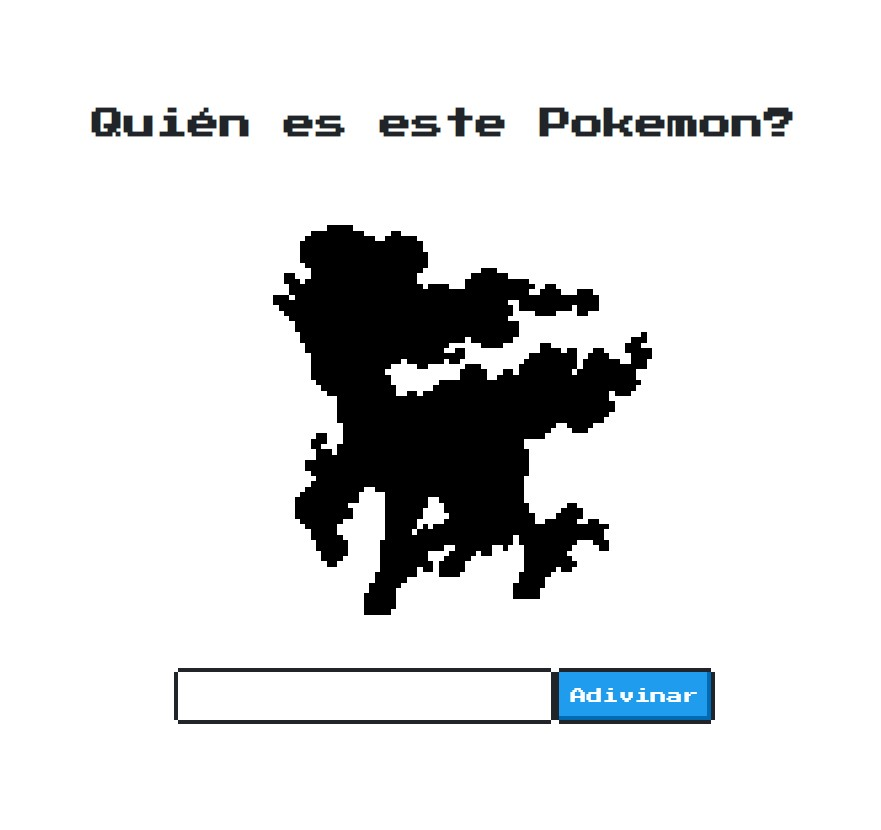

# Adivinar el Pokemon

Este proyecto es propuesto por [Goncy](https://twitter.com/goncy) en su [repositorio de challenge](https://github.com/goncy/interview-challenges)

El sitio fue deployado en Vercel : [Live site](https://game-guess-pokemon.vercel.app/) 

Este proyecto tiene 3 milestones o entregas, no es necesario que cumplas todas para dar el proyecto por terminado, ajustalo a tus necesidades y conocimientos. Cada entrega se vuelve un poco más difícil.
---

## Base
Nuestro cliente nos dio este repositorio listo para trabajar, usa la librería [NES.css](https://nostalgic-css.github.io/NES.css/) para estilos así que espera que uses los elementos provistos por la misma. También nos preparó un archivo [api.ts](./src/api.ts) con un método `random` que nos devuelve un Pokemon aleatorio para nuestra aplicación.

## Entrega 1
En esta primera entrega espera que al entrar a la página podamos ver la silueta de un Pokemon de manera aleatoria y al clickear adivinar mostremos la imágen real con el nombre del Pokemon.

> Bonus propuesto en el challenge: Mejorar la interfáz de la aplicación para que sea mas linda.

## Entrega 2
En esta segunda versión debemos cumplir los siguientes puntos:

* Luego de clickear el botón adivinar debemos también indicarle al usuario si acertó o no.
* Agregar un botón de volver a jugar.
>> En este caso el boton es para volver a empezar el juego con los contadores del siguiente paso volviendo a cero, ya que el cada vez que se adivina (o no) un pokemon, pasa automaticamente al siguiente.

* No tomar en cuenta espacios ni mayúsculas. ej: `mrmime`, `Mr. Mime`, `Mr MiMe` son válidos.

## Entrega 3
Agregar un contador que persista luego de refrescar la página con la cantidad de aciertos y errores del usuario.

>> Tambien se agregó un contador de intentos.